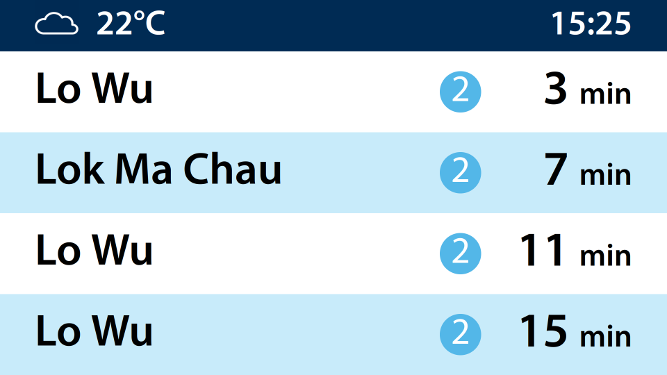

    <h1>MTR Railway Vision PIDS Simulator</h1>
    

---

This is a webpage that is designed to replicate the visual appearance of the Railway Vision PIDS screen seen in the Hong Kong MTR Network.

Real-time arrival data is supported with the [Real-time MTR train information Open Data](https://data.gov.hk/en-data/dataset/mtr-data2-nexttrain-data) provided by the MTR Corporation.

## Usage Note
### Fonts
By default, **DFLiSongHK (Chinese)** and **Myriad Pro** (English) will be used if installed on the user's computer, as these fonts are also employed in real world scenarios.  
However as these fonts are non-free, they will not be shipped to the user. Please obtain a copy of the font through legitimate means shall you wish for it to be used in the simulator.

**Fallback font:**
The following font will be used as a substitute if not found on user's computer:
- [Noto Sans (English)](https://fonts.google.com/noto/specimen/Noto+Sans?query=Noto+Sans)
- [Noto Serif TC (Chinese)](https://fonts.google.com/noto/specimen/Noto+Serif+TC)

## Issue Reporting / Suggestions
Please submit a new issue in the [GitHub Issue](https://github.com/hktss/mtr-pids/issues) page, or send an email to **hksimulationstudio(at)gmail.com**.

## License
This project is licensed under the [Apache License 2.0](https://www.apache.org/licenses/LICENSE-2.0)